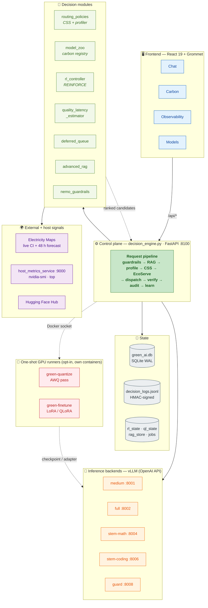
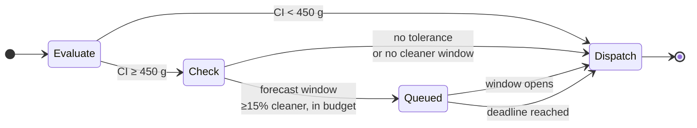
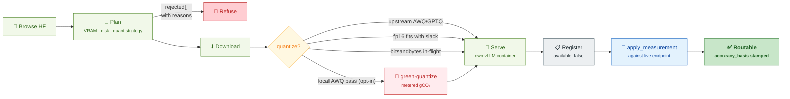
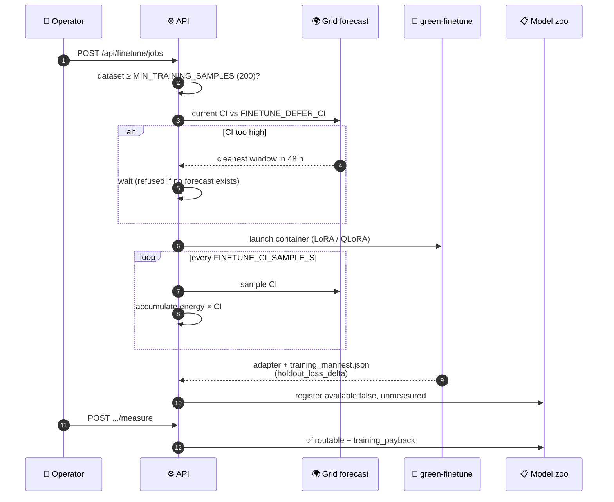

<div align="center">

# 🌱 Adaptive Green AI

**Carbon-aware LLM orchestration.** Every chat request becomes a sustainability-optimised routing decision
across a ladder of vLLM backends — scored, deferred, learned from, and signed into an audit trail.

[](https://www.python.org/)
[](https://fastapi.tiangolo.com/)
[](https://github.com/vllm-project/vllm)
[](https://react.dev/)
[](https://docs.docker.com/compose/)
[-76B900?logo=nvidia&logoColor=white)](https://www.nvidia.com/)
[](https://www.electricitymaps.com/)
[](#-api-surface)
[](#-tests)

</div>

---

## 📑 Table of contents

| | | |
|---|---|---|
| [What this is](#-what-this-is) | [Architecture](#-architecture) | [Request lifecycle](#-request-lifecycle) |
| [The carbon model](#-the-carbon-model) | [CSS routing](#-css--composite-sustainability-score) | [RL controller](#-rl-controller) |
| [EcoServe deferral](#-ecoserve--carbon-aware-deferral) | [Model ladder](#-the-model-ladder) | [Model onboarding](#-model-onboarding--quantization) |
| [Fine-tuning](#-carbon-aware-fine-tuning) | [RAG & guardrails](#-rag--guardrails) | [Frontend](#-frontend) |
| [Quick start](#-quick-start) | [Configuration](#-configuration) | [API surface](#-api-surface) |
| [Data layout](#-data-layout) | [Tests](#-tests) | [Operations](#-operations--the-failure-modes-that-bite) |
| [Measured results](#-measured-results--honest-limitations) | [Repo map](#-repo-map) | [Docs](#-further-documentation) |

---

## 🎯 What this is

Most LLM deployments pick a model once and serve every request from it. This project treats **model
selection as a per-request sustainability decision**: a single FastAPI control plane profiles the prompt,
prices every candidate backend in grams of CO₂ against the *live* grid carbon intensity, ranks them with a
weighted **Composite Sustainability Score**, and dispatches to the greenest candidate that still clears the
request's latency SLA and accuracy floor.

Around that core sit the pieces that make the decision trustworthy and improvable:

| Capability | What it does | Module |
|---|---|---|
| 🧮 **LLMCarbon accounting** | Operational + embodied gCO₂ per request, from measured wall-clock, not token guesses | `model_zoo.py` |
| ⚖️ **CSS routing** | Ranks candidates on carbon / latency / accuracy / cost / region with per-tier weights | `routing_policies.py` |
| 🧠 **Online RL** | REINFORCE + EMA baseline nudges tier weights from every observed outcome | `rl_controller.py` |
| 📈 **Learned q/l estimator** | Per-prompt accuracy & latency corrections feeding CSS — carbon left untouched | `quality_latency_estimator.py` |
| ⏳ **EcoServe deferral** | Queues tolerant work into the cleanest window in a 48 h grid forecast | `deferred_queue.py` |
| 📚 **Hybrid RAG** | Dense + sparse retrieval, cross-encoder rerank, evidence-sufficiency gate | `advanced_rag.py` |
| 🛡️ **Guardrails** | Action-based input/output rails, no external LLM dependency | `nemo_guardrails.py` |
| 🖼️ **Multimodal** | Vision (VLM) + image generation with a carbon-capped step budget | `multimodal.py` |
| 📦 **Model onboarding** | Browse HF → plan quantization against real free VRAM → download → serve → register | `model_onboarding.py` |
| 🎓 **Carbon-aware fine-tuning** | LoRA/QLoRA scheduled into a clean grid window, metered, with payback maths | `finetuning.py` |
| 🔏 **Signed audit trail** | HMAC-SHA256 JSONL — every decision replayable | `decision_engine.py` |

> [!NOTE]
> The design principle throughout: **a number is only allowed to influence routing once it has been
> measured.** Newly onboarded models and freshly trained adapters register as `available: false` with
> `accuracy_basis: "unmeasured"` and are invisible to the router until real figures are posted against a
> live endpoint.

---

## 🏗️ Architecture



**Container topology** (`docker-compose.ubuntu-vgpu.yml`):

| Service | Image | Port | Role |
|---|---|---|---|
| 🟢 `green-frontend` | built (nginx) | `8080` | React bundle + `/api/*` reverse proxy |
| 🟢 `green-api` | built | `8100` | Decision engine, 71 endpoints |
| 🟢 `green-metrics` | built | `9000` | Host GPU/CPU sidecar (CPU-only by design) |
| 🟠 `green-vllm-medium` | `vllm/vllm-openai` | `8001` | TinyLlama-1.1B-Chat |
| 🟠 `green-vllm-full` | `vllm/vllm-openai` | `8002` | Qwen2-1.5B-Instruct |
| 🟠 `green-vllm-guard` | `vllm/vllm-openai` | `8008` | Safety classifier |
| 🟣 `green-vllm-stem-math` | `vllm/vllm-openai` | `8004` | Qwen2.5-Math-1.5B *(profile `stem`)* |
| 🟣 `green-vllm-stem-science` | `vllm/vllm-openai` | `8005` | Qwen2.5-1.5B *(profile `stem-science-dedicated`)* |
| 🟣 `green-vllm-stem-coding` | `vllm/vllm-openai` | `8006` | Qwen2.5-Coder-1.5B *(profile `stem`)* |
| ⚪ `green-vllm-fallback` | `vllm/vllm-openai` | `8007` | CPU fallback *(profile `fallback`)* |
| ⚪ `green-vllm-moe` | `vllm/vllm-openai` | `8003` | MoE candidate *(profile `moe`, not resident)* |

---

## 🔄 Request lifecycle

`POST /api/chat` runs the whole pipeline in order. No stage is an optional bypass — each either passes work
forward or short-circuits with a deterministic, auditable substitute.

```mermaid
flowchart LR
    A["📥 Prompt<br/>+ attachments"]:::in --> B["🧭 Profile<br/><small>intent · complexity<br/>SLA · accuracy floor<br/>modality</small>"]:::step
    B --> C["📚 RAG retrieve<br/><small>hybrid + rerank<br/>evidence gate</small>"]:::step
    C --> D["🛡️ Input rails"]:::guard
    D --> E{"⚖️ CSS rank<br/>candidates"}:::decide
    E --> F{"🌍 Grid CI<br/>≥ 450 g?"}:::decide
    F -->|"yes + tolerant"| G["⏳ Defer to<br/>cleanest window"]:::defer
    F -->|"no"| H["🚀 Dispatch to vLLM<br/><small>text · vision · image-gen</small>"]:::run
    G -.->|"window opens"| H
    H --> I["🔍 Grounding +<br/>quality verify"]:::step
    I --> J["🛡️ Output rails"]:::guard
    J --> K["🔏 HMAC audit<br/>+ SQLite persist"]:::store
    K --> L["🧠 RL reward<br/>+ q/l estimator update"]:::learn
    L -.->|"new tier weights"| E

    classDef in fill:#E3F2FD,stroke:#1565C0,color:#0D47A1
    classDef step fill:#F1F8E9,stroke:#558B2F,color:#33691E
    classDef guard fill:#FFEBEE,stroke:#C62828,color:#B71C1C
    classDef decide fill:#FFF8E1,stroke:#F9A825,color:#F57F17
    classDef defer fill:#E0F7FA,stroke:#00838F,color:#006064
    classDef run fill:#FFF3E0,stroke:#EF6C00,color:#E65100
    classDef store fill:#ECEFF1,stroke:#455A64,color:#263238
    classDef learn fill:#F3E5F5,stroke:#6A1B9A,color:#4A148C
```



<details>
<summary><b>All 23 stages, in execution order</b></summary>

| # | Stage | Module | Adds to context |
|---|---|---|---|
| 1 | Conversation lookup / create | `conversation_store` | `conversation_id`, history |
| 2 | Attachment parsing | `decision_engine` | `parsed_attachments` |
| 3 | Semantic prompt profiling | `routing_policies.infer_prompt_profile` | intent, complexity, variant, SLA, accuracy floor, STEM domain, modality |
| 4 | Tier policy + RL override | `rl_controller.get_policy` | `(w_carbon, w_latency, w_accuracy, w_cost, w_region)` |
| 5 | Live carbon + GPU metrics | `monitoring_layer` + sidecar | `grid_carbon`, `system_power_w`, GPU util, 48 h forecast |
| 6 | CSS candidate ranking | `routing_policies.rank_routing_candidates` | ranked list with operational + embodied carbon |
| 7 | GPU-aware re-rank | `apply_gpu_routing_adjustment` | demotions when the GPU is constrained |
| 8 | STEM domain steer | `decision_engine` | promote stem-math / stem-coding / full |
| 9 | EcoServe evaluation | `routing_policies.evaluate_ecoserve_actions` | `deferral_recommended`, `regional_reroute`, best window |
| 10 | MoE expert placement + SLA guard | `model_zoo.plan_expert_placement` | placement plan, dense fallback on SLA blowout |
| 11 | RAG retrieval | `advanced_rag.retrieve` | fused, reranked chunks |
| 12 | Evidence sufficiency | `decision_engine` | `grounded_request`, `coverage_ratio` |
| 13 | Prompt assembly + semantic cache | `semantic_cache` | conversation-scoped cache lookup |
| 14 | Token count + overflow escalation | `decision_engine` | escalate variant if over context cap |
| 15 | Deterministic intercept | `decision_engine` | arithmetic / tables answered without a GPU |
| 16 | Input guardrails | `nemo_guardrails` | block jailbreaks / harmful content |
| 17 | Inference | `run_vllm_inference` / `multimodal` | response + variant actually used |
| 18 | GPU CO₂ attribution | `compute_gpu_co2` | measured per-request gCO₂ |
| 19 | Output guardrails | `nemo_guardrails` | block PII / unsafe content |
| 20 | Grounding verification + fallbacks | `decision_engine` | extractive fallback, full-model retry, rule-based net |
| 21 | Persistence | `conversation_store.save_message` | user + assistant rows |
| 22 | Audit entry | `log_decision` | HMAC-SHA256-signed JSONL row |
| 23 | RL outcome update *(background)* | `rl_controller.record_outcome` | new tier weights, baseline EMA |

</details>

Every chat response carries the full decision record — `sustainability_score`, `grid_carbon`,
`estimated_request_co2_g`, the candidate ranking, `retrieval`, `guardrails`, `rl_policy`, `tokens`, and
`gpu` — so the UI can show *why* a request went where it did.

---

## 🧮 The carbon model

> [!IMPORTANT]
> Operational carbon is **power × measured time**, not FLOPs. FLOP and token counts are reporting metadata
> and deliberately do **not** enter any carbon number — using both would double-count the same work. The
> LLMCarbon FLOP form is the alternative for when no measured duration exists, which is never the case here.

**Operational:**

```
C_op (gCO₂) = (TDP × t × PUE) / (HE_eff × 3.6e6) × CI × region_multiplier

  TDP     device TDP in W          (e.g. 145 W medium, 225 W full)
  t       measured inference seconds
  PUE     1.3 default for this vGPU rack
  HE_eff  hardware efficiency × (1 − all_to_all_overhead) for MoE
  CI      live grid carbon intensity, gCO₂/kWh — Electricity Maps
```

**Embodied:**

```
C_emb = (mfg_carbon_kg × 1000) / (lifetime_years × annual_volume × avg_s) × t
        ≈ 143 kg per A100-class board · 5 y · 100 000 inferences/y
```

`carbon_total = C_op + C_emb`, stored per candidate so the audit log can prove the breakdown.

Two consequences fall out of the power × time form, and both are intentional:

- Two responses of equal duration cost the same **regardless of length**.
- The MoE penalty is carried by `all_to_all_overhead_ratio` through `HE_eff` — **not** by a sparse FLOP count.

`compute_request_carbon` (ex-post, the source of truth for what a request cost) and
`compute_operational_carbon` (ex-ante, used for CSS ranking) share the identical energy term and must never
diverge.

---

## ⚖️ CSS — Composite Sustainability Score

Every candidate is min-max normalised across the candidate set on five dimensions, then combined with the
tenant tier's weights:

```mermaid
flowchart LR
    subgraph N["Normalised dimensions"]
        direction TB
        C["🌿 carbon_score<br/><small>1 − norm(total gCO₂)</small>"]:::c
        L["⚡ latency_score<br/><small>1 − norm(ms vs SLA)</small>"]:::l
        A["🎯 accuracy_score<br/><small>norm(acc, 0.45 → 1.0)</small>"]:::a
        M["💰 cost_score<br/><small>1 − norm(cost units)</small>"]:::m
        R["🌍 region_score<br/><small>zone CI + network hop</small>"]:::r
    end
    N --> W["Σ wᵢ · scoreᵢ<br/><small>per-tier weights, RL-adjusted</small>"]:::w
    W --> P["Penalties & bonuses"]:::p
    P --> S["🏆 Winner<br/><small>highest adjusted CSS</small>"]:::s
    S -.->|"top-5 persisted"| AU["🔏 audit log"]:::au

    classDef c fill:#C8E6C9,stroke:#2E7D32,color:#1B5E20
    classDef l fill:#FFF8E1,stroke:#F9A825,color:#F57F17
    classDef a fill:#E3F2FD,stroke:#1565C0,color:#0D47A1
    classDef m fill:#F3E5F5,stroke:#6A1B9A,color:#4A148C
    classDef r fill:#E0F7FA,stroke:#00838F,color:#006064
    classDef w fill:#F1F8E9,stroke:#558B2F,color:#33691E,font-weight:bold
    classDef p fill:#FFEBEE,stroke:#C62828,color:#B71C1C
    classDef s fill:#C8E6C9,stroke:#1B5E20,color:#1B5E20,font-weight:bold
    classDef au fill:#ECEFF1,stroke:#455A64,color:#263238
```



**Per-tier weights** (`config/policies.json`) — carbon-dominant by design, so the winner is the greenest
feasible candidate and latency/accuracy act as floors rather than as competing objectives:

| Tier | 🌿 carbon | ⚡ latency | 🎯 accuracy | 💰 cost | 🌍 region |
|---|---|---|---|---|---|
| `standard` | **0.55** | 0.14 | 0.18 | 0.08 | 0.05 |
| `premium` | **0.45** | 0.20 | 0.22 | 0.08 | 0.05 |
| `esg` | **0.70** | 0.08 | 0.12 | 0.06 | 0.04 |
| `batch` | **0.65** | 0.06 | 0.13 | 0.12 | 0.04 |

**Before scoring**, candidates are filtered on modality, on `available`, and on the accuracy floor — a
candidate below `accuracy_floor` is dropped outright. That filter is *permissive on empty*: if nothing
clears the floor, the unconstrained set is scored instead, which is when the `−0.18` penalty below actually
bites rather than being redundant with the filter.

**Adjustments applied after the weighted sum:**

| Adjustment | Trigger | Δ CSS |
|---|---|---|
| 🔴 SLA penalty | `latency_eff > sla_ms` | `−min(0.12 + 0.05×overshoot, 0.25)` |
| 🔴 Accuracy floor | `accuracy < accuracy_floor` (survivor of an empty filter) | `−0.18` |
| 🟡 Semantic alignment | variant distance from the profiler's preferred rung | `max(−0.12, 0.14 − 0.08×dist)` |
| 🟢 Exact variant match | `variant = recommended_variant` | `+0.02 + 0.04×complexity` |
| 🟢 MoE complexity bonus | `variant = moe ∧ complexity > 0.7` | `+0.04` |
| 🔴 High-carbon period | `CI ≥ 450 ∧ variant ∈ {full, moe} ∧ heavy not recommended` | `−0.05` |
| 🔴 Urgent + ultra-light | `priority ∈ {urgent, high} ∧ variant = ultra-light` | `−0.04` |

The per-candidate accuracy and latency inputs are refined per prompt by
`quality_latency_estimator.py` (cold-start = identity, so an untrained estimator changes nothing).
**Carbon is never adjusted by the estimator** — it comes from measurement only.

---

## 🧠 RL controller

`rl_controller.py` adapts `(w_carbon, w_latency, w_accuracy, w_cost)` per tenant tier on **every** request
outcome — online REINFORCE with an EMA baseline, no offline training and no UI knobs. Weights persist to
`data/rl_state.json`, are projected back onto the valid simplex after each update, and can be reset per tier:

```bash
curl -X POST http://localhost:8100/api/rl/reset/standard
```

`tests/test_rl_invariants.py` pins the projection: weights stay non-negative and normalised no matter what
the reward stream does.

---

## ⏳ EcoServe — carbon-aware deferral



Deferral fires only when **all** of these hold: `CI ≥ 450 gCO₂/kWh`, the request declares a
`deferral_tolerance_ms > 0`, the selected target supports batching, and the 48 h forecast actually contains
a window at least 15 % cleaner within the tolerance budget. Queue depth is capped at 500 items;
`POST /api/queue/dispatch-now` drains it manually.

Two sibling primitives share the same evaluation: **regional reroute** (a cleaner zone exists) and **load
shaping** (high carbon, not deferrable → surface a hint for batch workloads).

---

## 🪜 The model ladder

Candidates are filtered to the request's **modality axis** first (`text` / `vision` / `image-gen`), so a
diffusion endpoint never competes with a chat model, and then on `available` — which is what keeps an
unmeasured onboarded model or fresh adapter out of the ranking.

**Text ladder** (the candidates CSS actually chooses between):

| Candidate | Variant | Model | Hardware | Accuracy | p50 | TDP | Batching |
|---|---|---|---|---|---|---|---|
| `local-vgpu-small` | `ultra-light` | DialoGPT-medium | vGPU | 0.66 | 55 ms | 95 W | ✅ |
| `local-vgpu-medium` | `medium` | TinyLlama-1.1B-Chat | vGPU | 0.81 | 110 ms | 145 W | ✅ |
| `local-vgpu-full` | `full` | Qwen2-1.5B-Instruct | vGPU | 0.92 | 225 ms | 225 W | ❌ |
| `local-cpu-fallback` | `ultra-light` | DialoGPT-medium | CPU | 0.60 | 320 ms | 70 W | ✅ |
| `local-cpu-llama2-7b-fallback` | `full` | Llama-2-7b-chat | CPU | 0.78 | 1800 ms | 110 W | ✅ |

**STEM specialists** — promoted by the domain steer at stage 8, not by CSS carbon rank alone:

| Candidate | Variant | Model | Accuracy | p50 | TDP |
|---|---|---|---|---|---|
| `local-vgpu-stem-math` | `stem-math` | Qwen2.5-Math-1.5B-Instruct | 0.91 | 240 ms | 225 W |
| `local-vgpu-stem-science` | `stem-science` | Qwen2.5-1.5B-Instruct | 0.89 | 240 ms | 225 W |
| `local-vgpu-stem-coding` | `stem-coding` | Qwen2.5-Coder-1.5B-Instruct | 0.88 | 210 ms | 225 W |

**Multimodal** (own modality axes): `nim-vlm-nemotron` (`vlm`, 0.90 / 520 ms / 350 W),
`nim-diffusion-sdxl` (`diffusion-sdxl`, 2600 ms / 350 W), `nim-diffusion-flux` (`diffusion-flux`,
5200 ms / 400 W).

**Registered but `available: false`**, so present in the zoo and invisible to the router until someone
turns them on: `local-vgpu-moe` (Qwen3-30B-A3B, not resident on this host) and the two regional reroute
targets `us-west-gpu-medium` (`US-CAL-CISO`) and `eu-gpu-medium` (`DE`).

> [!IMPORTANT]
> **Where these numbers actually come from.** `config/routing_targets.json` is *not* in the repo, and
> `load_routing_targets()` does **not** jump straight to the module defaults — it first tries
> `model_zoo.json` **next to the missing path**, which does exist. So the live candidate set is the 14-entry
> `models` list in `config/model_zoo.json`, read via `accuracy_baseline` / `latency_ms_p50` / `power_tdp_w`.
> `DEFAULT_ROUTING_TARGETS` in `routing_policies.py` is a *third*-tier fallback that only runs if
> `model_zoo.json` is missing or unparseable too — editing it will not change routing on a working checkout.
> Override the whole chain with `ROUTING_TARGETS_PATH`.

The same registry carries the LLMCarbon parameters — TDP, PUE, hardware efficiency, manufacturing carbon,
device lifetime, `device_share` — for every entry, which is why the candidate list and the carbon model
cannot drift apart: they are one file.

---

## 📦 Model onboarding & quantization

`model_onboarding.py` turns "find a better rung for the ladder" into one pipeline behind `/api/models` and
the **Models** tab.



Four rules are load-bearing:

1. **Measurement gates availability.** A new model registers `available: false` / `accuracy_basis:
   "unmeasured"` and `routing_policies` filters on `available`, so CSS *cannot* select it. Only
   `apply_measurement` — posted by the caller against a live endpoint — flips it. The shipped zoo declares
   `full` at 0.92 accuracy; it measured **0.793** in practice, and onboarding must not automate that gap.
   Device-level fields (TDP, embodied carbon, lifetime) are *inherited* from a same-hardware donor and
   labelled `device_fields_basis`; model-level fields are never guessed.
2. **VRAM is the binding constraint, and MIG makes the obvious query wrong.** `--query-gpu=memory.total`
   reports the whole board (24576 MiB) while the usable instance is 21547 MiB, so the probe parses the MIG
   table and records a `vram_basis`.
3. **Prefer a pre-quantized checkpoint.** Plan order: upstream AWQ/GPTQ → fp16 when it fits with slack →
   vLLM in-flight `bitsandbytes` (load-time, so it costs throughput not carbon) → a local AWQ pass, opt-in
   only, in its own container, metered from measured wall-clock into `quantization_carbon_g`. Every refusal
   carries a `rejected[]` list explaining what lost and why.
4. **Registration is optional.** `POST /api/models/quantize` (`register=False`) runs the same pipeline and
   stops after the pass — the checkpoint is downloadable from `/api/models/artifacts/{id}/download` as an
   uncompressed tar, but nothing enters the zoo. Quantizing a model and adding a rung to *this*
   deployment's ladder are separate decisions.

> [!WARNING]
> Dynamic serving needs the Docker socket bind-mounted (`docker-compose.onboarding.yml`) — that is
> **root-equivalent on the host**, hence the separate opt-in file. `trust_remote_code` is arbitrary code
> execution from a model repo and needs its own gate, `MODEL_ONBOARD_ALLOW_TRUST_REMOTE_CODE`.

---

## 🎓 Carbon-aware fine-tuning

`finetuning.py` is the counterpart to onboarding: onboarding *imports* a better rung, fine-tuning makes the
**existing small one good enough** at real traffic so CSS stops escalating. Training data is up-voted pairs
from `/api/feedback/export`.



Five rules:

| # | Rule | Why |
|---|---|---|
| 1 | **PEFT only** | A full fine-tune doesn't fit a shared 21.5 GB MIG slice beside live inference, and costs orders of magnitude more energy than a rank-16 adapter |
| 2 | **Deferral is real** | Above `FINETUNE_DEFER_CI` the job waits for the cleanest 48 h window; deferral is *refused* with no forecast, because that's an open-ended wait, not a saving |
| 3 | **Carbon integrated, not snapshotted** | CI sampled every `FINETUNE_CI_SAMPLE_S`, energy × CI accumulated per interval — a job that waited for a clean window is credited for the hours it actually ran in |
| 4 | **Not routable until measured** | The adapter deliberately does *not* inherit the base's accuracy; the whole point is that quality changed. `apply_measurement` records `training_payback` |
| 5 | **Own container** | The API image's torch targets CUDA 13 against this host's 12.8 driver and can't init CUDA; peft/trl/datasets are absent there |

Serving uses vLLM's `--enable-lora` / `--lora-modules`, so an adapter costs a few MB on top of a loaded
base — **expensive to make, nearly free to keep**. Down-votes are discarded (supervised tuning can't use
them — that needs DPO) and the rule-based degradation notice is filtered out so the model never learns to
apologise for being unavailable.

The trainer writes an **adapter only, never a merged model** — a merged 1.5B checkpoint is 3 GB on disk and
a second full set of weights in VRAM, which is the entire carbon argument gone. A held-out split is always
evaluated, *and* the base model is evaluated on it first, so `holdout_loss_delta` says whether the adapter
actually got better on data it never saw.

---

## 📚 RAG & guardrails

**`advanced_rag.py`** — chunking with metadata enrichment, hybrid dense (sentence-transformers) + sparse
(BM25-like) retrieval, cross-encoder reranking, context fusion, persisted to `data/rag_store.json`. If the
sentence-transformer models are unavailable it degrades to hashed dense embeddings and heuristic reranking
rather than failing closed. An evidence-sufficiency gate decides whether the request is `grounded_request`
before the prompt is assembled, and grounding is verified again after generation.

**`nemo_guardrails.py`** — self-contained action-based rails (no external LLM, no ColBERT), applied on both
input and output phases. Toggle with `GUARDRAILS_ENABLED`; action mapping lives in `guardrails/config.yml`.

---

## 🖥️ Frontend

React 19 + Grommet (HPE design system), Vite dev server on **:5200** proxying `/api/*` → `127.0.0.1:8100`.

| Tab | Component | Shows |
|---|---|---|
| 💬 **Chat** | `GreenAIChat.jsx` | Chat plus live sidebars: grid carbon, RL weights, queue depth, system metrics |
| 🌿 **Carbon** | `CarbonDashboard.jsx` | Per-request CO₂ breakdown, grid intensity, forecast |
| 📊 **Observability** | `ObservabilityPanel.jsx` | Routing distribution, decisions, audit-derived stats |
| 📦 **Models** | `ModelsPanel.jsx`, `FineTunePanel.jsx` | HF browse/onboard/quantize, artifacts, fine-tune jobs |

That is the whole live tree: `App.jsx` → `GreenAIChat.jsx` → the three panels above (`FineTunePanel` nested
inside `ModelsPanel`). All fetch calls are centralised in `src/lib/api.js`.

> [!NOTE]
> **Five components in `src/Components/` are unreferenced** and get tree-shaken out of the production
> bundle: `ArchitecturePanel.jsx`, `RLPanel.jsx`, `HeaderExample.jsx`, `FooterExample.jsx` and
> `MenuExample.jsx` (the last imported only by `HeaderExample`, which is itself dead). Nothing imports them,
> so editing them changes nothing on screen — verify against the built bundle before assuming a change
> shipped. RL weights *are* surfaced, but by `GreenAIChat`'s own sidebar, not by `RLPanel`.

---

## 🚀 Quick start

### Option A — Docker (production path)

```bash
cp .env.example .env      # set EMAP_TOKEN for live grid signals
docker compose -f docker-compose.ubuntu-vgpu.yml --env-file .env up --build -d
```

<table>
<tr><th align="left">Service</th><th align="left">URL</th></tr>
<tr><td>🖥️ Frontend</td><td><code>http://localhost:8080</code></td></tr>
<tr><td>⚙️ API health</td><td><code>http://localhost:8100/health</code></td></tr>
<tr><td>⚙️ API readiness</td><td><code>http://localhost:8100/health/ready</code></td></tr>
<tr><td>📊 Metrics sidecar</td><td><code>http://localhost:9000/health</code></td></tr>
</table>

The frontend container proxies `/api/*` to the backend, so remote browsers can use the UI without a rebuild
against the VM IP. The API waits for the vLLM backends and the metrics sidecar to report healthy before
declaring itself ready.

**With HTTPS** — point a DNS hostname at the VM, set `PUBLIC_HOSTNAME` in `.env`, and add the Caddy overlay:

```bash
docker compose -f docker-compose.ubuntu-vgpu.yml -f docker-compose.https.yml --env-file .env up --build -d
```

**With quantization + fine-tuning** — build the two GPU runner images first, then bring the stack up with
both overlays (the onboarding overlay is required for either: both need the Docker socket):

```bash
docker build -f docker/quantize/Dockerfile -t green-quantize:latest .
docker build -f docker/finetune/Dockerfile -t green-finetune:latest .

docker compose -f docker-compose.ubuntu-vgpu.yml \
               -f docker-compose.onboarding.yml \
               -f docker-compose.finetune.yml \
               --env-file .env up --build -d
```

> [!NOTE]
> Both runner images derive from `vllm/vllm-openai:latest` deliberately: it is already on the host, and
> **its torch is the one proven to open a CUDA context against this 12.8-era vGPU driver**, unlike the API
> image's CUDA-13 build. Both Dockerfiles **clear `ENTRYPOINT`** — the base image's entrypoint starts the
> vLLM API server, so leaving it in place makes every job silently start a web server and time out instead
> of doing the work.

### Option B — Local dev

```bash
# Backend
pip install -r requirements.txt
uvicorn decision_engine:app --reload --host 0.0.0.0 --port 8100

# Metrics sidecar (separate terminal)
python host_metrics_service.py

# Frontend
cd frontend && npm install && npm run dev     # → http://localhost:5200
```

---

## 🔧 Configuration

Everything comes from `.env` — see `.env.example` for the full set. The ones that matter most:

<details open>
<summary><b>Core</b></summary>

| Variable | Purpose |
|---|---|
| `VLLM_MEDIUM_URL`, `VLLM_FULL_URL` | The two required vLLM endpoints (`:8001`, `:8002`). `ultra-light` and `medium` both dispatch to the medium one |
| `VLLM_MOE_URL`, `VLLM_STEM_*_URL`, `VLLM_FALLBACK_URL` | Optional dedicated endpoints — each falls back to `VLLM_FULL_URL`, so a single-container deploy still routes |
| `EMAP_TOKEN`, `EMAP_ZONE` | Electricity Maps credentials + primary grid zone |
| `GPU_TDP`, `GPU_VRAM_GB` | Hardware spec for LLMCarbon calculations |
| `GUARDRAILS_ENABLED` | Toggle the safety rails |
| `RAG_EMBEDDING_MODEL`, `RAG_RERANKER_MODEL` | Sentence-transformer model IDs |
| `DISABLE_GPU_METRICS=1` | Safe default — keeps the sidecar healthy when Docker GPU/CDI integration is imperfect |

> [!NOTE]
> **There is no Triton Inference Server in this stack** — serving is vLLM's OpenAI-compatible server
> throughout. Older `.env` files may still carry `TRITON_TIMEOUT_SECONDS`, `TRITON_READY_WAIT_SECONDS` or
> `TRITON_{ULTRA_LIGHT,MEDIUM,FULL,MOE}_MODEL`; no code reads them, so they can be deleted. The live
> equivalents are `VLLM_*_URL` and `VLLM_TIMEOUT_SECONDS`.

</details>

<details>
<summary><b>Learning & routing</b></summary>

| Variable | Purpose |
|---|---|
| `RL_ALPHA_0`, `RL_REWARD_LAMBDA_*` | RL learning rate and reward component weights |
| `QL_ESTIMATOR_ENABLED`, `QL_ESTIMATOR_LR`, `QL_ESTIMATOR_WARMUP` | Learned quality/latency estimator toggle, LR, warm-up threshold |
| `ROUTING_TARGETS_PATH` | Override the built-in `DEFAULT_ROUTING_TARGETS` |

</details>

<details>
<summary><b>Multimodal</b></summary>

| Variable | Purpose |
|---|---|
| `NIM_VLM_URL`, `NIM_SDXL_URL`, `NIM_FLUX_URL` | NVIDIA NIM endpoints; unset → graceful placeholder fallback |
| `DIFFUSION_HIGH_CARBON_CI` | Grid CI above which image generation trims its denoising-step budget |

</details>

<details>
<summary><b>Onboarding & quantization</b></summary>

| Variable | Purpose |
|---|---|
| `MODEL_ONBOARD_ENABLED` | Master switch. Browse/preview work while false; nothing downloads, serves or registers |
| `HF_TOKEN_ENC` | HF token encrypted with `secret_box.py` — preferred over plaintext `HF_TOKEN` |
| `MODEL_ONBOARD_VRAM_RESERVE_MB`, `MODEL_ONBOARD_DISK_RESERVE_GB` | Headroom the planner must leave free |
| `MODEL_SERVE_IMAGE`, `MODEL_SERVE_NETWORK`, `MODEL_SERVE_PORT_BASE`, `HF_CACHE_HOST_PATH`, `DOCKER_SOCKET` | Dynamic serving; needs `docker-compose.onboarding.yml` |
| `MODEL_QUANT_IMAGE`, `MODEL_QUANT_COMMAND` | Opt-in AWQ pass. Unset → capability reports unavailable rather than pretending to work |
| `QUANT_CALIB_FILE` | Calibration corpus. Point at a `/api/feedback/export` JSONL to fit scales on *this* deployment's traffic |
| `MODEL_ONBOARD_ALLOW_TRUST_REMOTE_CODE` | Second gate on arbitrary code execution from a model repo |

</details>

<details>
<summary><b>Fine-tuning</b></summary>

| Variable | Purpose |
|---|---|
| `FINETUNE_ENABLED`, `MODEL_FINETUNE_IMAGE`, `MODEL_FINETUNE_COMMAND` | Master switch + trainer runner |
| `FINETUNE_DEFER_CI`, `FINETUNE_LOOKAHEAD_H`, `FINETUNE_MAX_WAIT_S`, `FINETUNE_CI_SAMPLE_S` | Defer threshold, forecast horizon, give-up point, CI sampling interval |
| `FINETUNE_WORK_DIR`, `FINETUNE_WORK_DIR_HOST` | Dataset + adapter location as the API sees it and as the Docker daemon sees it — **must be the same directory** |

</details>

---

## 🌐 API surface

71 endpoints on the control plane. Grouped:

| Group | Endpoints |
|---|---|
| 💬 **Chat** | `POST /api/chat` · `POST /decision` · `GET|DELETE /api/conversations[/{id}]` |
| 📚 **RAG** | `GET /api/rag/status` · `GET /api/rag/documents` · `POST /api/rag/index` · `DELETE /api/rag/documents/{id}` |
| ⚖️ **Routing & RL** | `GET /api/rl/status` · `GET /api/rl/history` · `POST /api/rl/reset/{tier}` · `GET /api/routing/quality-latency-estimator` · `GET /api/policy/suggest` |
| 🌍 **Carbon & grid** | `GET /api/grid/zones` · `GET /api/grid/forecast` · `GET /api/system/metrics` · `GET /api/observability/summary` · `GET /api/sustainability/csrd-report` |
| ⏳ **Queue** | `GET /api/queue/status` · `POST /api/queue/dispatch-now` |
| 📋 **Model zoo** | `GET /api/model-zoo` · `GET /api/model-zoo/{id}/carbon` · `.../expert-health` · `.../expert-placement` · `POST /api/model-zoo/reconcile` · `GET|POST /api/model-zoo/updates[...]` |
| 📦 **Onboarding** | `GET /api/models/capability` · `/catalog/search` · `/catalog/preview` · `/registry` · `/jobs[/{id}]` · `POST /api/models/onboard` · `POST /api/models/quantize` · `GET|DELETE /api/models/artifacts[/{id}[/download]]` · `POST /api/models/{id}/serve|unserve|measure` |
| 🎓 **Fine-tuning** | `GET /api/finetune/capability` · `/dataset` · `/preview` · `/jobs[/{id}]` · `POST /api/finetune/jobs` · `.../cancel` · `POST /api/finetune/adapters/{id}/serve|measure` |
| 👍 **Feedback** | `POST /api/feedback` · `GET /api/feedback/stats` · `GET /api/feedback/export` |
| 🏢 **Tenancy & budgets** | `GET /api/tenancy/whoami` · `GET|POST|DELETE /api/budgets[/{tenant}]` |
| ⚡ **Cache** | `GET /api/cache/status` · `POST /api/cache/clear` · `POST /api/cache/clear-all` |
| 🖼️ **Multimodal** | `GET /api/multimodal/status` |
| 🔏 **Audit** | `GET /api/audit` |
| ❤️ **Health** | `GET /health` · `GET /health/ready` |

---

## 💾 Data layout

```
data/
├── green_ai.db                  SQLite (WAL) — conversations, messages, feedback
├── rag_store.json               RAG chunks + embeddings
├── rl_state.json                RL policy weights per tier
├── ql_estimator_state.json      Learned accuracy/latency weights feeding CSS
├── model_onboarding.json        HF onboarding job history
├── finetuning.json              LoRA/QLoRA job history + measured training carbon
├── decision_logs.jsonl          HMAC-signed audit trail
├── hf-cache/                    Hugging Face model cache
│   └── quantized/<id>/          Locally quantized checkpoints (downloadable whole)
└── finetune/<job>/              train.jsonl + adapter/
```

> [!WARNING]
> **Path discipline.** The runner and the vLLM container both see the shared cache at
> `CONTAINER_HF_CACHE` (`/root/.cache/huggingface`) while the API sees the same bytes at its own `HF_HOME`.
> Anything handed to a launched container must use the *container* path — `artifact_local_path` is the only
> place that conversion happens.

---

## 🧪 Tests

```bash
python3 -m pytest         # config in pyproject.toml
```

| Suite | Covers |
|---|---|
| `test_carbon_golden.py` | Golden values against `tests/fixtures/model_zoo_min.json` |
| `test_carbon_properties.py` | Invariants and bounds on the shipped zoo |
| `test_rl_invariants.py` | RL weight projection stays on the simplex |
| `test_model_onboarding.py` | Planner, VRAM/MIG parsing, measurement gating |
| `test_finetuning.py` | Deferral logic, integrated carbon, payback |
| `test_runner_scripts.py` | Runner argument parsing + output verification, **without a GPU** |

The suite deliberately does **not** import `decision_engine` — that needs fastapi and the full backend
stack. Tests target the dependency-light modules directly and construct isolated instances via explicit
paths rather than patching import-time constants. That is also why heavy imports in
`scripts/finetune_train.py` and `scripts/quantize_awq.py` are lazy, inside `main()`.

---

## 🛠️ Operations — the failure modes that bite

> [!CAUTION]
> **Do not trust `/health` on a vLLM container.** It is answered by the API server process and stays `200`
> while the EngineCore behind it is wedged. On **2026-07-29** all three containers here reported healthy for
> ~21 hours while every completion hung until the client timed out. The compose healthchecks therefore run
> `scripts/vllm_healthcheck.py <port>`, which generates one real token.
>
> ```bash
> docker exec green-vllm-full-1 python3 /healthcheck.py 8002 && echo generating
> ```

> [!CAUTION]
> **vGPU licensing — check this first.** This host is an H100L-2-24C vGPU running NVIDIA Virtual Compute
> Server. When the licence lapses the driver keeps *existing* CUDA contexts alive but refuses **new** ones,
> so running containers look fine while anything restarted dies with `CUDA error: operation not supported`
> during engine init.
>
> ```bash
> nvidia-smi -q | grep -A2 "vGPU Software Licensed Product"   # want: Licensed
> journalctl -u nvidia-gridd -n 20 --no-pager
> ```
>
> If it reports `Unlicensed`, **restarting a container destroys the only thing keeping it working.** For a
> corrupted trusted store (`Failed to update local trusted store - Maximum buffer size exceeded`): stop
> `nvidia-gridd`, clear `/var/lib/nvidia/vGPULicensing/*`, start it again so it re-registers from the token
> in `/etc/nvidia/ClientConfigToken/`.

> [!WARNING]
> **`gpu-memory-utilization` is not a cap.** With several vLLM containers sharing one MIG slice, boot order
> decides who starves. Pin the KV pools with `--num-gpu-blocks-override` rather than trusting the utilisation
> fraction.

---

## 📉 Measured results & honest limitations

This repo keeps its negative results in view, because they shaped the design:

- **The three-arm benchmark showed always-full beating CSS on carbon *and* quality.** The reason is a menu
  problem, not a policy one: `ultra-light` / `small` / `medium` / `local-cpu-fallback` all dispatch to the
  same TinyLlama container with hand-written differing TDPs, and TinyLlama is both **more verbose**
  (108 vs 94 tokens) and **less accurate** than Qwen2.5-1.5B — so the "cheap" rung costs more for worse
  answers. That finding is what `model_onboarding.py` exists to fix: quantization builds *real* rungs.
- **Length-aware routing changed nothing measurable.** Measured output-length priors didn't move routing,
  because the STEM hoist pins code prompts and bypasses the CSS carbon rank. Noise floor was ±8 %.
- **The shipped zoo overstates accuracy.** `full` declares 0.92 and measured 0.793. This is exactly why
  measurement gates availability everywhere in the onboarding and fine-tuning paths.

Removed features you may find referenced in older commits: the workflow automation engine and the benchmark
harness were deleted (2026-07-29), and the LangGraph coding arena (2026-08-04). `secret_box.py` survives
from the workflow engine — the `wf-secret-v1` domain tag is unchanged so previously encrypted values still
decrypt.

---

## 🗂️ Repo map

| Path | Role |
|---|---|
| `decision_engine.py` | FastAPI app; 71 endpoints; orchestrates the whole pipeline |
| `routing_policies.py` | CSS scoring, tier policies, semantic profiler, MoE accounting, multi-region reroute |
| `model_zoo.py` | Versioned registry + operational & embodied carbon |
| `rl_controller.py` | Online REINFORCE; persists learned weights |
| `quality_latency_estimator.py` | Learned per-prompt accuracy/latency corrections |
| `advanced_rag.py` | Hybrid retrieval, sparse fallback, cross-encoder reranking |
| `multimodal.py` | VLM + diffusion dispatch via pluggable NIM endpoints |
| `monitoring_layer.py` | Electricity Maps (live + 48 h), GPU/CPU metrics via sidecar |
| `model_onboarding.py` | HF browse → plan → download → serve → register pipeline |
| `finetuning.py` | Carbon-aware LoRA/QLoRA training + payback |
| `deferred_queue.py` | Priority queue for high-carbon windows (max 500) |
| `nemo_guardrails.py` | Action-based safety rails |
| `semantic_cache.py` | Conversation-scoped semantic cache |
| `conversation_store.py` | SQLite WAL persistence |
| `budgets.py`, `tenancy.py` | Per-tenant budgets and tier resolution |
| `csrd_reporting.py` | CSRD-shaped sustainability report |
| `secret_box.py` | Stdlib authenticated encryption for secrets at rest |
| `host_metrics_service.py` | Sidecar on :9000 → `system_metrics.sh` → nvidia-smi / top |
| `scripts/finetune_train.py` | LoRA/QLoRA trainer (adapter only, held-out eval) |
| `scripts/quantize_awq.py` | AWQ pass with `verify_output` on `quant_method` |
| `config/` | `policies.json`, `model_zoo.json` |
| `docker/`, `deploy/` | Runner image definitions and deployment assets |
| `frontend/` | React 19 + Grommet UI |
| `docs/`, `paper/` | Solution PDFs, ArchiMate diagrams, generators |

---

## 📖 Further documentation

| Document | Contents |
|---|---|
| [`SOLUTION.md`](SOLUTION.md) | Full solution document — module-by-module logic, formulas, annotated end-to-end example |
| [`CLAUDE.md`](CLAUDE.md) | Engineering notes and the load-bearing constraints behind each design choice |
| `docs/Adaptive_Green_AI_Solution.pdf` | Rendered solution document |
| `docs/Adaptive_Green_AI_Deployment.pdf` | Deployment guide |
| `docs/architecture_archimate.puml` | ArchiMate architecture model |

---

<div align="center">
<sub>Adaptive Green AI · carbon-aware LLM orchestration · every decision measured, signed, and replayable</sub>
</div>
